# Da Profiler — Architecture & System Design 🏗️

> **Da Profiler** (package `dqs`) is an isolated query profiling engine and static code advisor for Django applications, exposed through **two surfaces**: a Postman-style workbench UI for humans (`fe/`) and an MCP server for AI agents (`dqs/mcp/`). Both surfaces drive the same **execution proxy** (`dqs/adapters/drf/execution/proxy.py`), which accepts user/agent-supplied payloads, runs them inside a toggleable atomic-rollback sandbox, intercepts queries at the DB-driver boundary, and normalizes SQL via AST fingerprinting to detect N+1 bottlenecks. Static code analysis runs against the whole codebase without execution.

---

## 1. Core Architectural Principles

Da Profiler is built around four fundamental design principles:

1. **Framework-Agnostic Core (`dqs/core/`)**:
   - The core engine contains **zero Django or framework-specific imports**.
   - Handles SQL AST fingerprinting (`sqlglot`), N+1 aggregation algorithms, target abstractions (`Target`), and framework-independent static AST code scanning (`StaticASTAdvisor`).

2. **Single Execution Engine, Two Surfaces**:
   - One engine (`dqs/adapters/drf/execution/`) is consumed by two surfaces:
     - The **workbench UI** (`fe/`) — human-facing, Postman-style request builder + response/SQL viewer.
     - The **MCP server** (`dqs/mcp/`) — agent-facing, exposes the engine as MCP tools.
   - Both surfaces call the **execution proxy** (`proxy.execute_request()`) — never the low-level runner directly. The proxy owns the request-shape contract; the runner is the internal engine.

3. **User/Agent-Supplied Payloads, Not Synthetic Ones**:
   - The execution proxy accepts whatever the caller wants to send.
   - A lean `payload_suggester.suggest_payload(target_id)` helper inspects the target's serializer and returns a JSON template as a *starting point* — it never writes to the DB.
   - The v0.3 mock-data generator and request-body inferrer are **deleted** in v0.35. Auto-seeding the DB before each request was the wrong abstraction: it polluted query counts, made destructive endpoints risky even in a sandbox, and forced both surfaces into a synthetic-data worldview.

4. **Zero Database Risk by Default, Toggleable When Needed**:
   - Profiled requests run inside `transaction.atomic()` savepoints and roll back automatically — the real database is never modified.
   - The caller can opt out per-call (`sandbox: False` in the proxy request) when it actually wants to verify a write persisted (e.g. the agent confirming a POST created a row).

---

## 2. System Component Overview

```
                        +-------------------+    +-------------------+
                        |  Workbench UI     |    |   MCP Server      |
                        |  (fe/) — human    |    |   (dqs/mcp/) —    |
                        |                   |    |   agent surface   |
                        +---------+---------+    +---------+---------+
                                  |                        |
                                  |  POST /dqs/api/...    |
                                  +-----------+------------+
                                              |
                                              v
+-----------------------------------------------------------------------------------+
|                          Django Adapter (dqs/adapters/drf/)                       |
|                                                                                   |
|  +------------------------+    +-------------------------+    +----------------+  |
|  |   Execution Proxy      |    |      Auth Layer         |    | Target Discov. |
|  |  (execution/proxy.py)  | -- | (auth/impersonation.py, | -- | (discovery.py) |
|  |                        |    |  auth/audit.py)         |    |               |
|  +----------+-------------+    +-------------------------+    +----------------+  |
|             |                                                                |
|             v                                                                |
|  +------------------------+    +-------------------------+    +----------------+  |
|  |  Sandbox Runner        |    |   Query Interceptor     |    | Payload Suggs. |
|  |  (execution/runner.py) | -- | (query_interceptor.py)  |    |(payload_       |
|  |                        |    |                         |    | suggester.py)  |
|  +------------------------+    +-------------------------+    +----------------+  |
|                                                                                  |
+-----------------------------------------------------------------------------------+
              |                            |                          |
              v                            v                          v
+-----------------------------------------------------------------------------------+
|                              Da Profiler Core (dqs/core/)                          |
|                                                                                   |
|  +---------------------+   +--------------------------+   +--------------------+  |
|  |     Target Model    |   |     Static AST Advisor   |   |   AST Analyzer     |  |
|  |     (targets.py)    |   |   (static_advisor.py)    |   |   (analyzer.py)    |  |
|  +---------------------+   +--------------------------+   +--------------------+  |
+-----------------------------------------------------------------------------------+
```

---

## 3. High-Level Component Breakdown

### A. Core Engine (`dqs/core/`)

#### 1. `analyzer.py` (AST SQL Analyzer & N+1 Detector)
- **`fingerprint(sql)`**: Leverages `sqlglot` to parse raw SQL queries into ASTs. It strips dynamic literals (e.g. IDs, strings), normalizes dynamic `IN (...)` parameter lists, and canonicalizes table aliases (`T0`, `T1`).
- **`detect_n_plus_one(queries, threshold)`**: Groups queries by a composite key of `(SQL Fingerprint, source_location)` and flags N+1 patterns that exceed the threshold.
- **`suggest_fix(fingerprint, relationships)`**: Generates copy-pasteable Django ORM fixes (such as `.select_related()` or `.prefetch_related()`) that the workbench renders and the MCP `apply_fix` tool applies.

#### 2. `targets.py` (Unified Target Dataclass)
- Defines the `Target` dataclass (`id`, `kind`, `triggerable`, `trigger_spec`, `static_findings`).
- Provides a unified shape for HTTP views, signals, Celery tasks, and background functions, consumed identically by the workbench sidebar and the MCP `list_targets` tool.

#### 3. `static_advisor.py` (Framework-Agnostic AST Advisor)
- Scans user python code statically without importing or executing it.
- **ORM Call in Loop**: Detects `.filter()`, `.get()`, `.all()` calls inside `for` loops.
- **Blocking Calls**: Detects synchronous I/O (`requests.get`, `smtplib.SMTP`, `time.sleep`) and resolves `import X as Y` and `from X import Y` aliases.

### B. Django Adapter (`dqs/adapters/drf/`)

#### 1. `execution/proxy.py` (Execution Proxy — *new in v0.5*)
- **`execute_request(request: ProxyRequest) -> ProxyResponse`**: The **single entry point** for both the workbench UI and the MCP server.
- Validates the `target_id` resolves to a known `Target`, the method is allowed, and the path params match the converters (no auto-seeding — returns a clear `400` if a path param can't be resolved).
- Honors the per-call `sandbox: bool` toggle (default `True`).
- Attaches the requested user context via the auth layer, then dispatches to `SandboxRunner` underneath.

#### 2. `auth/impersonation.py` (Role Impersonation — *new in v0.5*)
- **`build_request_with_user(request, user_context, auth_mode)`**: Given a constructed WSGI request, attaches the right auth:
  - `auth_mode="session"` + `user_context=Impersonate(user_id)` → `request.user = User.objects.get(pk=user_id)` and `force_authenticate(request, user=user)`.
  - `auth_mode="bearer"` → generate a DRF token for the user, attach `Authorization: Token <token>` header.
  - `auth_mode="anonymous"` → leave `request.user = AnonymousUser()`.
- Powers the workbench's "Act As" dropdown and the MCP `execute_request` tool's `user_context` argument.

#### 3. `auth/audit.py` (AuthZ Audit Matrix — *new in v0.5*)
- **`audit_authz(target_id, user_ids[]) -> AccessMatrix`**: Runs the same target under N different user contexts in isolated transactions and returns a status matrix. Flags unexpected statuses as **Permission Leaks** or **Over-Restrictions**.
- Powers the workbench's "Audit Endpoint Access" button and the MCP `audit_authz` tool.

#### 4. `execution/discovery.py` (Target Discovery Engine)
- Discovers URL endpoints (`DjangoIntrospector`), Django signals (`post_save`, `pre_save`, `post_delete`), Celery tasks, and Channels ASGI consumers.
- Integrates static schema advisor checks (`schema_advisor.py`) for PK strategies and missing index detection.
- Populates `Target` instances and passes callables through `StaticASTAdvisor`. Consumed identically by the workbench sidebar and the MCP `list_targets` tool.

#### 5. `routing/introspector.py` (Route & URL Introspector)
- Recursively walks Django's `urlpatterns` tree.
- Categorizes views into DRF `ViewSet`, `APIView`, or standard Django function/class-based views.
- Safely reports `executable=False` when routes cannot be resolved statically.

#### 6. `execution/query_interceptor.py` (DB-Driver Boundary Interceptor)
- Context manager hooking into Django's `connection.execute_wrapper()`.
- Captures SQL, execution duration, and walks `inspect.stack()` to attribute each query to exact user code line numbers.
- Lives below the proxy — both surfaces benefit transparently because the proxy attaches it inside `profile_callable()`.

#### 7. `routing/converters.py` (Dynamic Path Converter Resolver)
- Extracts URL path converters (`int`, `slug`, `uuid`, `str`, `path`).
- Resolves path parameters against real DB rows first (`Model.objects.first()`); if no row exists and no explicit value is provided, returns `None` with `reason="no_record_found"` rather than auto-seeding.
- Deterministic fallback values (`int -> 1`, `uuid -> "123e4567-..."`, `slug -> "test-slug"`) are still available but are opt-in via `allow_synthetic_paths: bool = False` for tests/dev only.

#### 8. `payload_suggester.py` (Payload Suggester — *new in v0.35, replaces `mocking/`*)
- **`suggest_payload(target_id) -> { template, notes, warnings }`**: Inspects the target view's `serializer_class` / `get_serializer_class()` / `form_class` and returns a structured JSON template.
- Maps serializer field types (`CharField`, `EmailField`, `SlugField`, `IntegerField`, `DecimalField`, `DateTimeField`, `ChoiceField`, `PrimaryKeyRelatedField`, `NestedSerializer`, `JSONField`, `BooleanField`, `UUIDField`) to realistic placeholder values.
- Accepts an optional `field_overrides: dict` so the UI can pre-fill known values (e.g. the selected user's PK for `PrimaryKeyRelatedField`).
- **Never writes to the DB.** Powers the workbench's "Populate from schema" button and the MCP `suggest_payload` tool.

#### 9. `execution/runner.py` (Sandbox Execution Engine — low-level, called by the proxy)
- **`profile_callable(fn, *args, **kwargs)`**: Runs callables inside a `transaction.atomic()` savepoint with the `QueryInterceptor` active. This is the engine the proxy calls — both UI and MCP requests go through it transparently.
- **`execute_isolated()`**: Remains as a thin convenience wrapper that builds a request via `RequestFactory` and calls `profile_callable()`. Used internally by the proxy; not the public surface for v0.35+.

#### 10. `execution/schema_advisor.py` (Schema & Index Advisor)
- Analyzes Django ORM models to detect auto-increment PK strategies (recommends UUIDv7).
- Cross-references queried fields against model indexes to flag missing indexes.

### C. MCP Server (`dqs/mcp/` — *new in v0.4*)

- **`server.py`**: Native MCP server using the `mcp` SDK, exposing the engine over stdio and/or SSE transports.
- **Tools**: `list_targets`, `get_static_findings`, `suggest_payload`, `execute_request`, `audit_authz`, `apply_fix`.
- **Resources & Prompts**: `dqs://targets` resource, `fix_n_plus_one` and `audit_endpoint_access` prompt templates.
- Consumed by Cursor, Claude Code, Windsurf, and any other MCP-compatible IDE agent.

### D. Workbench UI (`fe/` — *promoted to primary human surface in v0.35*)

- React 18 + Vite + Tailwind CSS, dark Postman-inspired theme.
- Three-pane layout: route sidebar (left), request builder (center top), response + profiler (center bottom).
- Calls `/dqs/api/execute/`, `/dqs/api/audit/`, `/dqs/api/users/`, `/dqs/api/suggest-payload/` — the same HTTP surface the MCP server calls internally.
- See [`fe/README.md`](./fe/README.md) for component-level details.

---

## 4. Directory Structure Overview

```
dqs/
├── __init__.py
├── core/                              # Framework-agnostic engine (zero Django imports)
│   ├── analyzer.py                    # sqlglot-based SQL AST fingerprinting & N+1 detection
│   ├── static_advisor.py              # Pure AST static code scanner (loops, blocking I/O)
│   └── targets.py                     # Unified Target dataclass
├── adapters/
│   └── drf/                           # Django & DRF adapter
│       ├── __init__.py
│       ├── apps.py                    # DQS Django AppConfig (DEBUG guard)
│       ├── router.py                  # Shadow DB router & profiling_session context manager
│       ├── types.py                   # Shared dataclasses (ProxyRequest, ProxyResponse, AccessMatrix, ...)
│       ├── views.py                   # HTTP endpoints (/dqs/api/execute/, /dqs/api/audit/, /dqs/api/users/, /dqs/api/suggest-payload/)
│       ├── urls.py                    # URL configuration for the HTTP surface
│       ├── database/
│       │   └── db_manager.py          # Shadow DB validation & migration runner
│       ├── routing/
│       │   ├── introspector.py        # URL route pattern tree walker
│       │   └── converters.py          # Dynamic path parameter resolver (no auto-seeding)
│       ├── auth/                      # NEW in v0.5
│       │   ├── impersonation.py       # Session / Bearer / Anonymous user context injection
│       │   └── audit.py               # Multi-role AuthZ matrix runner
│       ├── payload_suggester.py       # NEW in v0.35 (replaces mocking/) — serializer→JSON template
│       └── execution/
│           ├── discovery.py           # Target discovery (views, signals, tasks, consumers)
│           ├── query_interceptor.py   # DB connection.execute_wrapper hook + QueryAnalysisEngine
│           ├── runner.py              # Savepoint execution & callable profiling (low-level engine)
│           ├── proxy.py               # NEW in v0.5 — single entry point for UI + MCP
│           └── schema_advisor.py      # Database schema & PK strategy recommendations
└── mcp/                               # NEW in v0.4
    ├── server.py                      # MCP server (stdio + SSE) + tool definitions
    └── tools/                         # Tool implementations grouped by concern
fe/                                    # React/Vite workbench UI (human surface)
```

> **Note:** The `dqs/adapters/drf/mocking/` directory and the `body_inferrer.py` module are **deleted** in v0.35. Their logic is folded into `payload_suggester.py`; their auto-seeding behavior is intentionally not preserved.

---

## 5. Class Sequence Diagrams

### 5.1 Core Classes

#### 5.1.1 `dqs.core.targets.Target` (Dataclass)

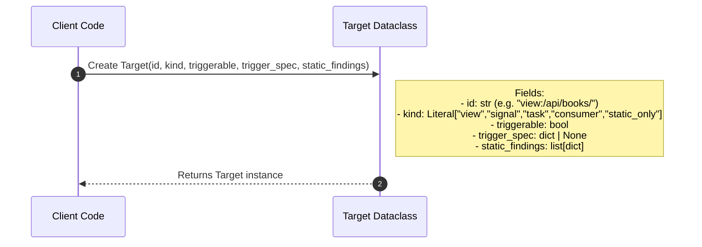

#### 5.1.2 `dqs.core.analyzer.AST Analyzer`

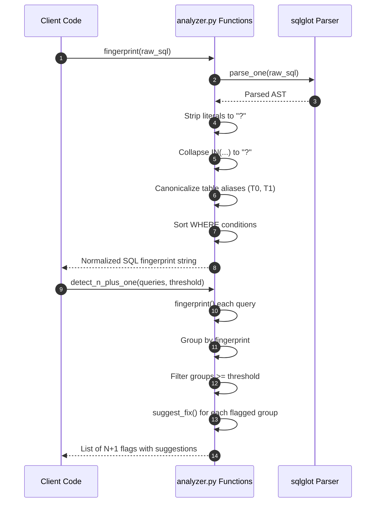

#### 5.1.3 `dqs.core.static_advisor.StaticASTAdvisor`

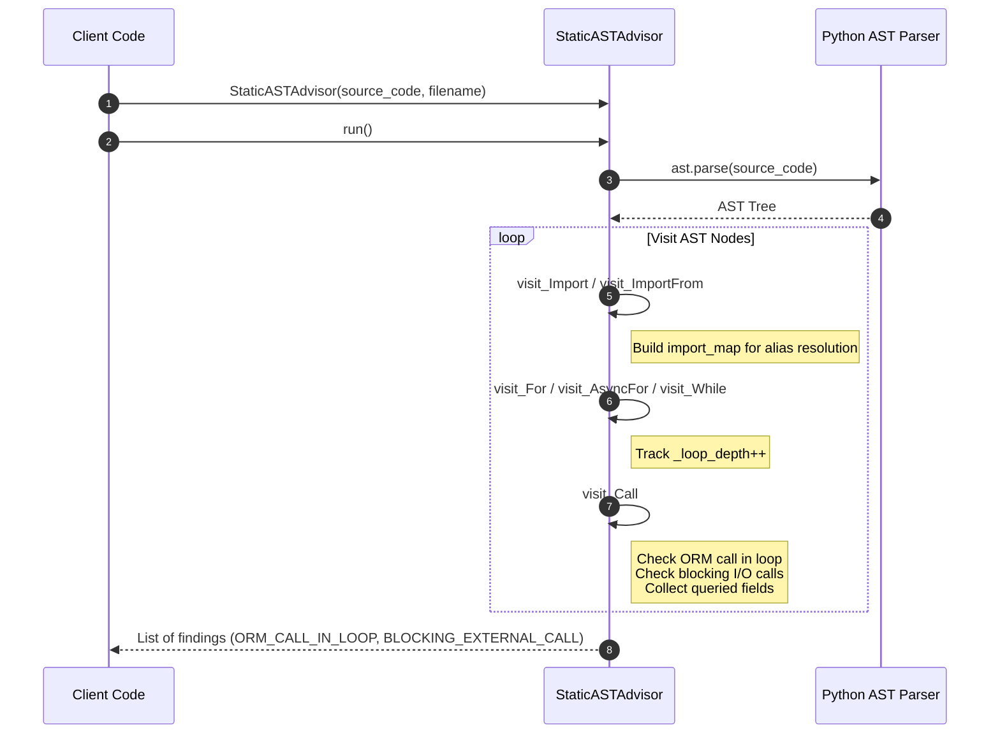

---

### 5.2 Django Adapter Classes

#### 5.2.1 `dqs.adapters.drf.routing.introspector.DjangoIntrospector`

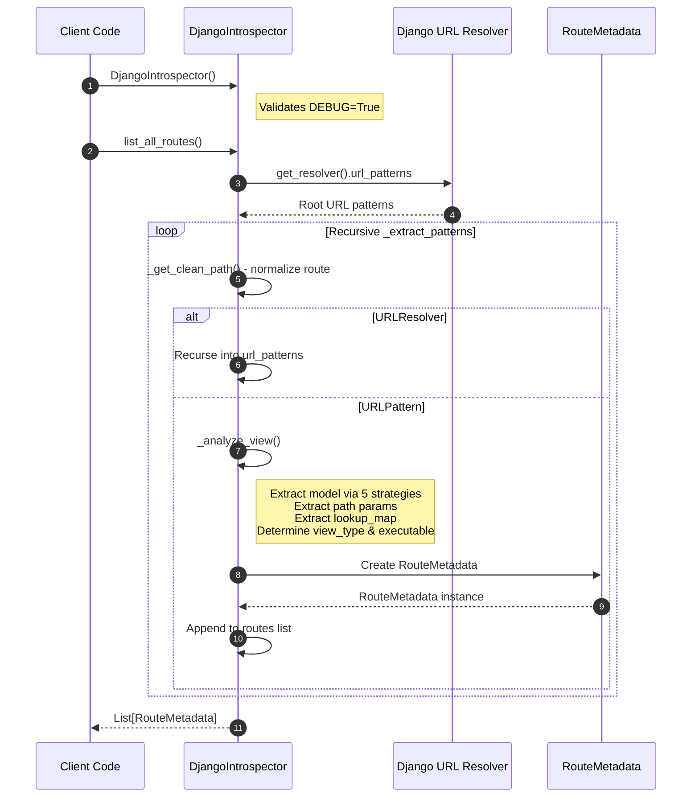

#### 5.2.2 `dqs.adapters.drf.routing.converters.PathConverterResolver`

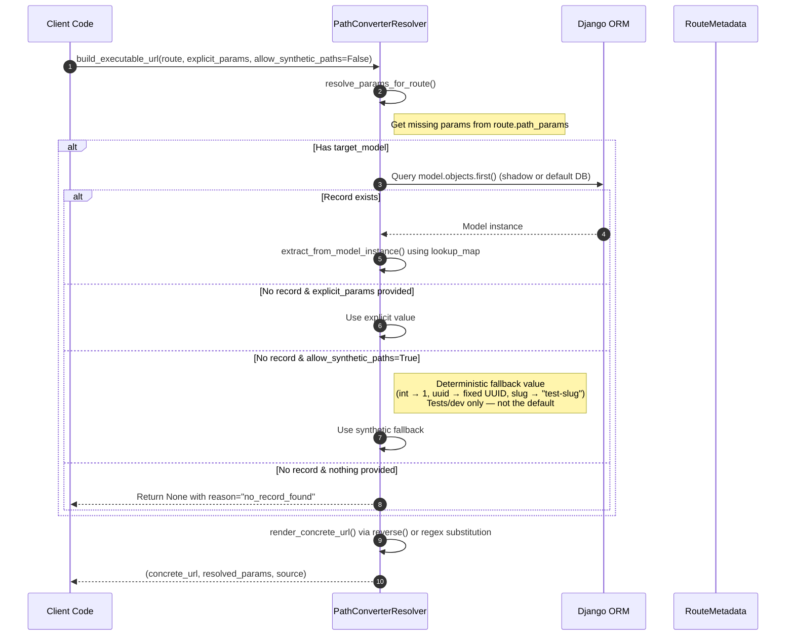

#### 5.2.3 `dqs.adapters.drf.payload_suggester.PayloadSuggester`

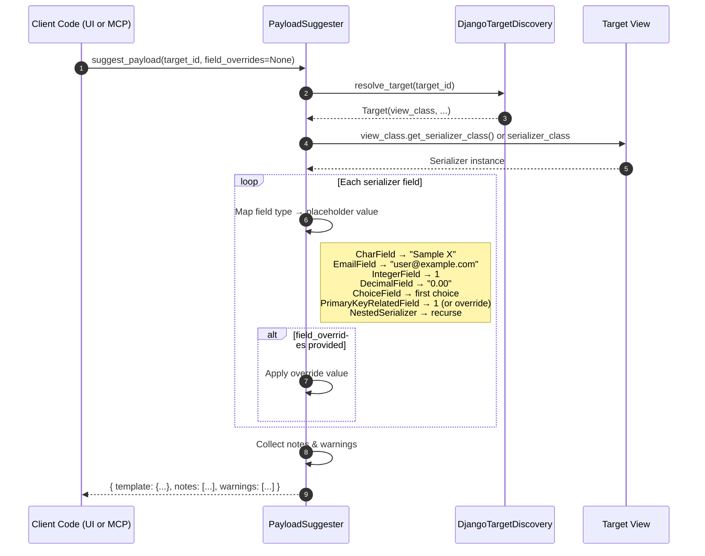

#### 5.2.4 `dqs.adapters.drf.execution.query_interceptor.QueryInterceptor`

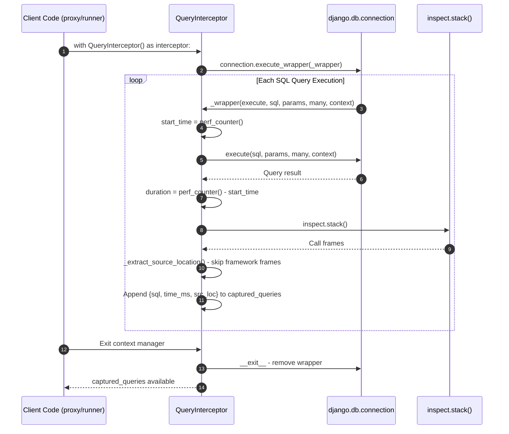

#### 5.2.5 `dqs.adapters.drf.execution.query_interceptor.QueryAnalysisEngine`

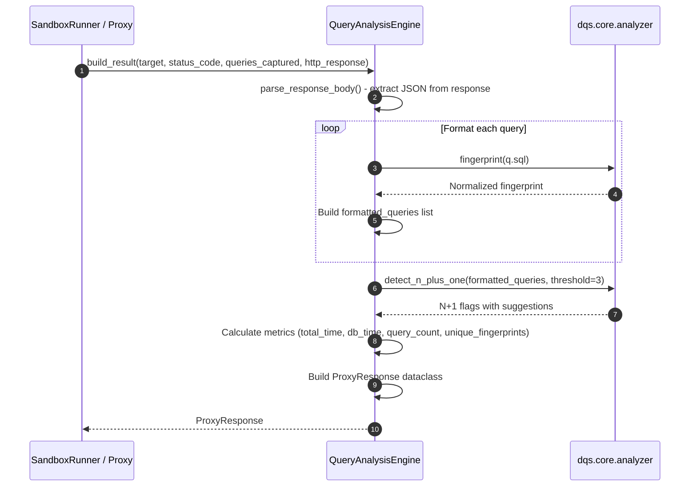

#### 5.2.6 `dqs.adapters.drf.execution.runner.DjangoSandboxRunner`

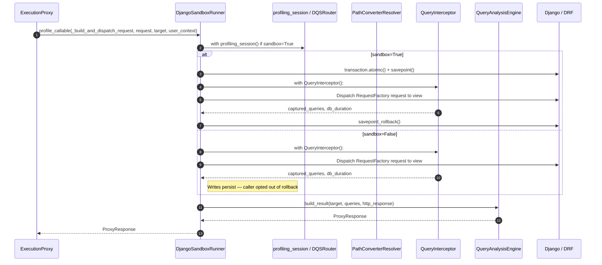

#### 5.2.7 `dqs.adapters.drf.execution.proxy.ExecutionProxy` *(new in v0.5)*

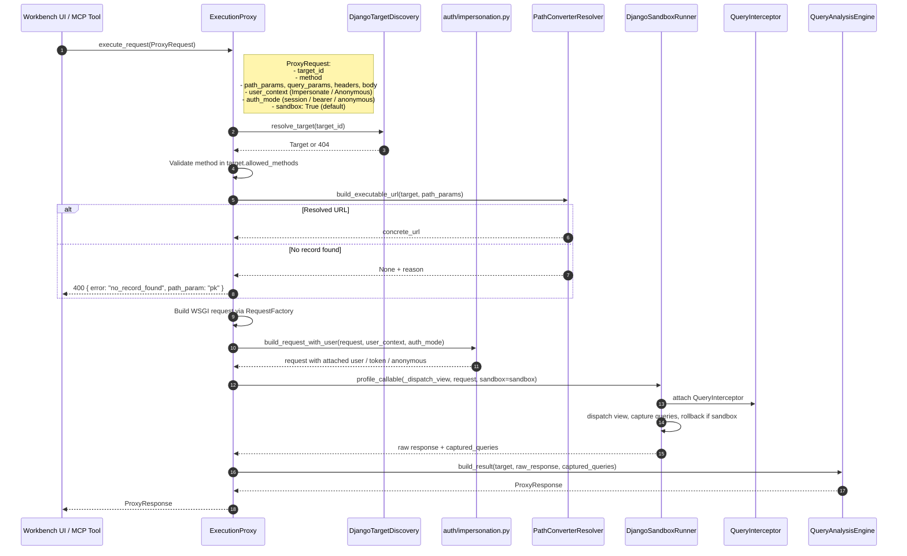

#### 5.2.8 `dqs.adapters.drf.auth.audit.audit_authz` *(new in v0.5)*

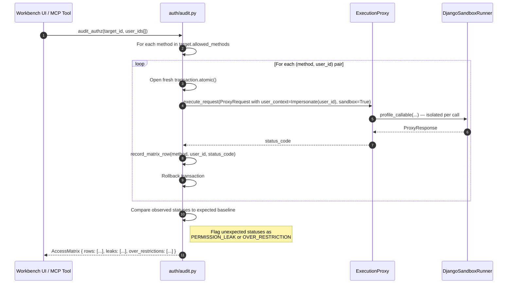

#### 5.2.9 `dqs.adapters.drf.execution.discovery.DjangoTargetDiscovery`

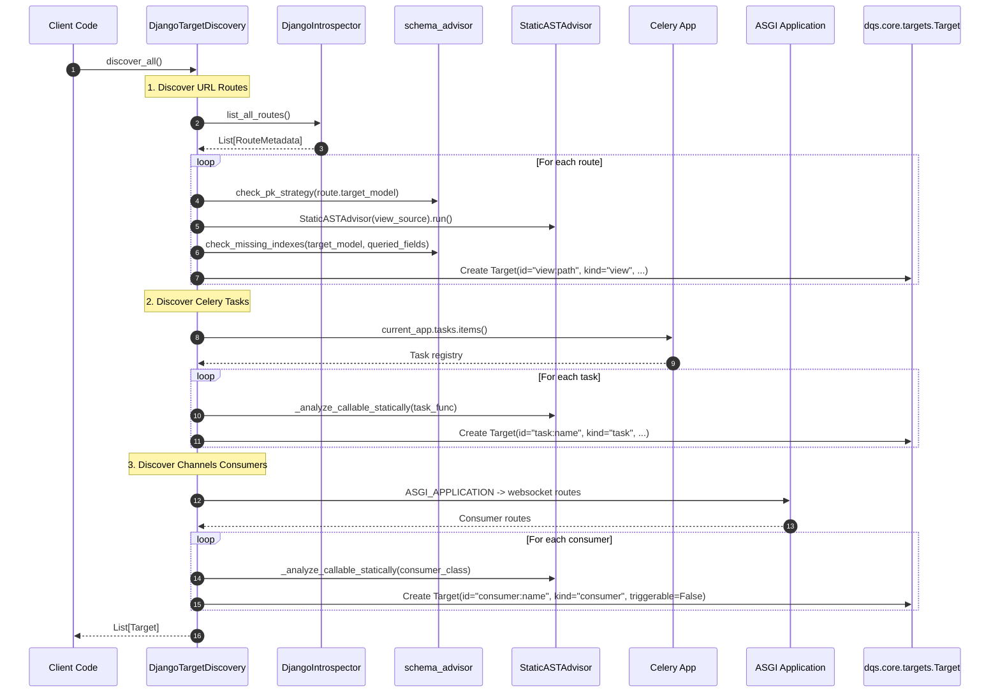

#### 5.2.10 `dqs.adapters.drf.router.DQSRouter` & `profiling_session`

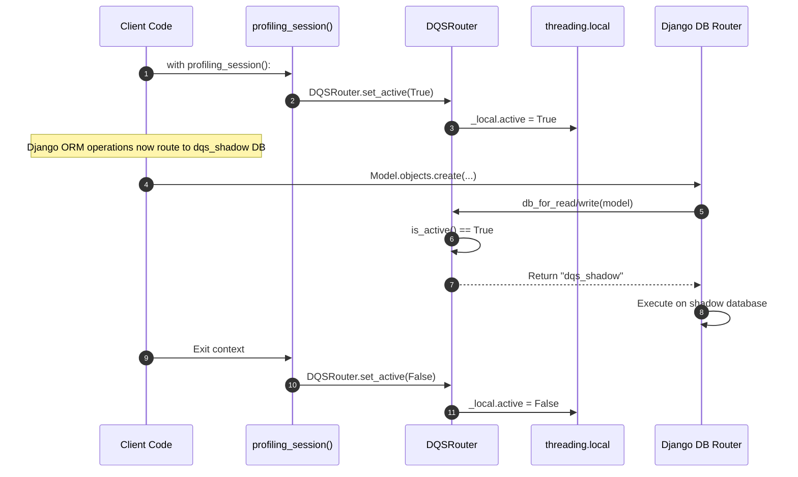

---

## 6. End-to-End Execution Sequence

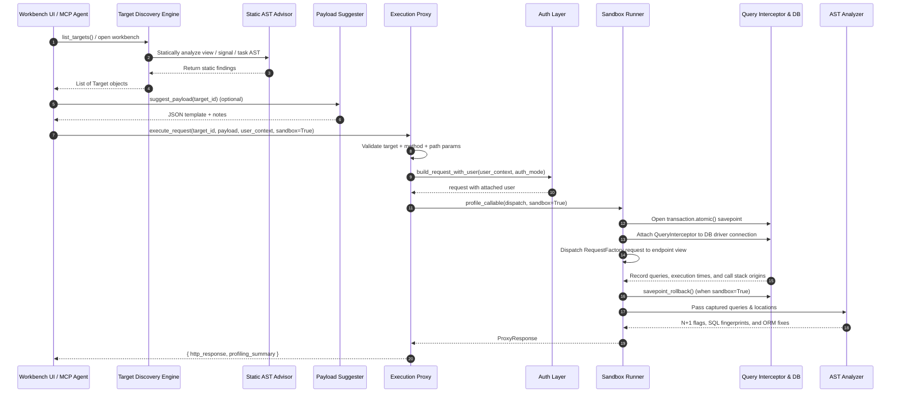

---

## 7. Security & Isolation Model

- **Toggleable Sandbox (default ON)**: Every request runs inside an atomic savepoint and is rolled back automatically. The caller can opt out per-call (`sandbox: False`) when it actually wants a write to persist.
- **`DEBUG=True` Guardrail**: Profiling runs only in development environments — enforced in `apps.py` and `DjangoIntrospector`.
- **Sanitized SQL**: AST fingerprinting strips user data/literals before rendering analysis reports.
- **Shadow Database** *(legacy / opt-out path)*: Optional isolated database (`dqs_shadow`) for cases when sandbox is off and the caller wants writes routed away from `default`. Configured via `DATABASE_ROUTERS` and `profiling_session()`.
- **No Network Roundtrip for Auth**: `force_authenticate` short-circuits the auth backend so user impersonation is instant. Tokens are generated in-process when `auth_mode="bearer"`.
- **No Auto-Seeding**: The proxy never writes to the DB on the caller's behalf. If a path param can't be resolved against real data, the request fails loudly with a clear reason — the UI surfaces this as "Pick a record or enter a value," the MCP agent gets a structured 400.

---

## 8. Installation & Testing

### Development Installation

```bash
# From source (editable install)
pip install -e "C:\Users\mprof\OneDrive\Desktop\da-profiler"

# Or build and install
pip install dist/da_profiler-0.3.0-py3-none-any.whl
```

### Demo Project Setup

```bash
# 1. Go to demo project
cd demos/drf

# 2. Install dependencies
pip install -e "..[django]"

# 3. Configure settings (DEBUG=True, dqs_shadow DB, DATABASE_ROUTERS)

# 4. Run migrations on shadow DB
python manage.py migrate --database=dqs_shadow

# 5. Run tests
pytest -m core        # Pure Python tests (fast, no DB)
pytest -m django      # Django/DRF adapter tests (requires DB)
pytest                # All tests
```

### Using in Your Own Project

```bash
# Install from PyPI
pip install da-profiler[django]

# Add to settings.py (development only)
if DEBUG:
    INSTALLED_APPS += ["dqs.adapters.drf"]
    DATABASE_ROUTERS = ["dqs.adapters.drf.router.DQSRouter"]

# Configure shadow database
DATABASES = {
    "default": {...},
    "dqs_shadow": {...},  # Same engine as default
}

# Run shadow migrations
python manage.py migrate --database=dqs_shadow
```

---

## 9. Key Data Flow Summary

| Stage | Input | Component | Output |
|-------|-------|-----------|--------|
| **Discovery** | Django URL patterns + signal/task registries | `DjangoTargetDiscovery` | `List[Target]` (consumed by workbench sidebar AND `list_targets` MCP tool) |
| **Static analysis** | Target source code | `StaticASTAdvisor` | `static_findings` (N+1 candidates, blocking I/O) |
| **Payload suggestion** | `target_id`, optional `field_overrides` | `PayloadSuggester` | `{ template, notes, warnings }` — never writes to DB |
| **Path-param resolution** | Route + explicit params | `PathConverterResolver` | Concrete URL, or `None + reason` if no record found |
| **Execution proxy** | `ProxyRequest` (target_id, payload, user_context, sandbox) | `ExecutionProxy` | `ProxyResponse` (http_response + profiling_summary) |
| **Auth injection** | request + user_context + auth_mode | `auth/impersonation.py` | request with `force_authenticate` / token / anonymous |
| **Sandbox execution** | View callable + WSGI request | `DjangoSandboxRunner.profile_callable` | HTTP response + captured queries |
| **Interception** | DB queries | `QueryInterceptor` | Queries with origin (file:line) + duration |
| **AuthZ audit** | target_id + user_ids[] | `auth/audit.py` | `AccessMatrix` with leak/over-restriction flags |
| **Analysis** | Captured queries | `QueryAnalysisEngine` + `analyzer.py` | N+1 flags + ORM fixes |
| **Agent loop** | N+1 flag + suggested fix | MCP `apply_fix` tool | AST-edited source; re-profile to verify |

---

## 10. Complete Flow Diagrams

For detailed visual flow diagrams covering:
- Route discovery & workbench sidebar loading
- Complete profiling execution (request builder click to results)
- Query interception & N+1 detection
- AuthZ audit matrix generation
- High-level component interactions
- Simplified flow summary

See **[Flow Diagrams](./docs/flow-diagrams.md)**.
