# Da Profiler — Architecture & System Design 🏗️

> **Da Profiler** (package `dqs`) is an isolated query profiling engine and static code advisor for Django applications, exposed through **two surfaces**: a Postman-style workbench UI for humans (`fe/`) and an MCP server for AI agents (`dqs/mcp/`). Both surfaces drive the same **execution proxy** (`dqs/adapters/drf/execution/proxy.py`), which accepts user/agent-supplied payloads, runs them inside a toggleable atomic-rollback sandbox, intercepts queries at the DB-driver boundary, and normalizes SQL via AST fingerprinting to detect N+1 bottlenecks. Static code analysis runs against the whole codebase without execution.

---

## 1. Core Architectural Principles

Da Profiler is built around four fundamental design principles:

1. **Framework-Agnostic Core (`dqs/core/`)**:
   - The core engine contains **zero Django or framework-specific imports**.
   - Handles SQL AST fingerprinting (`sqlglot`), N+1 aggregation algorithms, target abstractions (`Target`), and framework-independent static AST code scanning (`StaticASTAdvisor`).

2. **Single Execution Engine, Two Surfaces**:
   - One engine (`dqs/adapters/drf/execution/`) is consumed by two surfaces:
     - The **workbench UI** (`fe/`) — human-facing, Postman-style request builder + response/SQL viewer.
     - The **MCP server** (`dqs/mcp/`) — agent-facing, exposes the engine as MCP tools.
   - Both surfaces call the **execution proxy** (`proxy.execute_request()`) — never the low-level runner directly. The proxy owns the request contract (method, path, payload, user context, sandbox toggle); the runner is the internal engine that dispatches the request.

3. **User/Agent-Supplied Payloads, Not Synthetic Ones**:
   - The execution proxy accepts whatever the caller wants to send, payloads are sent via `POST /profiler/execute` with a `body` field.
   - A `suggest_payload(target_id)` helper is **deferred to a later release**, payloads are currently typed in by the developer in the workbench, or constructed programmatically by the MCP agent.
   - The v0.3 mock-data generator (`dqs/adapters/drf/mocking/`) and request-body inferrer (`body_inferrer.py`) were **deleted** in the v0.35 cleanup. Auto-seeding the DB before each request was the wrong abstraction: it polluted query counts, made destructive endpoints risky even in a sandbox, and forced both surfaces into a synthetic-data worldview.

4. **Zero Database Risk by Default, Toggleable When Needed**:
   - Profiled requests run inside shadow db and can be rolled back immediately, the real database is never modified.
   - The caller can opt out per-call (`sandbox: False` in the proxy request) when it actually wants to verify a write persisted (e.g. the agent confirming a POST created a row).

---

## 2. System Component Overview

The diagram below shows how a single request flows from a surface down into the
engine. Reading top-to-bottom: two surfaces call one proxy, the proxy validates

- resolves + dispatches via the runner, the runner attaches the interceptor
  inside a transaction savepoint, the captured queries get analyzed by the core
  SQL fingerprinting engine, and the structured response bubbles back up.

```
                        +-------------------+    +-------------------+
                        |   Workbench UI    |    |    MCP Server     |
                        |   (fe/) — human   |    |  (dqs/mcp/) —     |
                        |   surface         |    |   agent surface   |
                        +---------+---------+    +---------+---------+
                                  |                        |
                                  |  POST /profiler/execute (etc.)
                                  |  same wire format for both
                                  +-----------+------------+
                                              |
                                              v
+----------------------------------------------------------------------+
|                  Django Adapter (dqs/adapters/drf/)                  |
|                                                                      |
|   +----------------------+        +---------------------------+       |
|   |   Target Discovery   | -----> |     Execution Proxy       |       |
|   |  (execution/         |  feeds |   (execution/proxy.py)    |       |
|   |   discovery.py)      |  list  |   validate + resolve +    |       |
|   +----------------------+   of   |   dispatch + collect      |       |
|             ^              Target +-----------+---------------+       |
|             |                            |                       |
|             |                                uses |                       |
|             |                                  v                       |
|   +----------------------+        +---------------------------+       |
|   |  Routing: Introspector|       |   Auth Impersonation      |       |
|   |  + Converter Resolver |       |  (auth/impersonation.py)  |       |
|   |  (routing/*.py)       |       |   attach user to request  |       |
|   +----------------------+        +---------------------------+       |
|                                                                      |
|                          +---------------------------+               |
|                          |      Sandbox Runner       |               |
|                          |  (execution/runner.py)    |               |
|                          |  - transaction.atomic()   |               |
|                          |  - rollback if sandbox    |               |
|                          +-------------+-------------+               |
|                                        | attaches                     |
|                                        v                              |
|                          +---------------------------+               |
|                          |   Query Interceptor       |               |
|                          |  (query_interceptor.py)   |               |
|                          |  hooks execute_wrapper()  |               |
|                          +-------------+-------------+               |
|                                        | feeds                        |
|                                        v                              |
|                          +---------------------------+               |
|                          |   Query Analysis Engine   |               |
|                          |  (query_interceptor.py)   |               |
|                          |  fingerprint + N+1 detect |               |
|                          +-------------+-------------+               |
+----------------------------------------|-----------------------------+
                                          v
+----------------------------------------------------------------------+
|                  Da Profiler Core (dqs/core/) — pure Python          |
|                                                                      |
|   +---------------------+   +---------------------+   +-------------+  |
|   |    Target Model     |   |  Static AST Advisor |   |  SQL AST    |  |
|   |    (targets.py)     |   |  (static_advisor.py)|   |  Analyzer   |  |
|   +---------------------+   +---------------------+   | (analyzer.py)|  |
|                                                        +-------------+  |
+----------------------------------------------------------------------+
```

**Reading the diagram:**

- The **two surfaces** at the top share the same wire format (`POST /profiler/execute`).
- The **Execution Proxy** is the single fan-in point. It calls three things: **Target Discovery** (to resolve `target_id` → `Route`), **Auth Impersonation** (to attach a user to the WSGI request), and the **Sandbox Runner** (to actually dispatch the view).
- The **Sandbox Runner** wraps the dispatch in `transaction.atomic()` and attaches the **Query Interceptor** at the DB-driver boundary.
- The **Query Analysis Engine** consumes the captured queries and asks the **Core SQL AST Analyzer** to fingerprint them and detect N+1 patterns.
- The **Core layer** (`dqs/core/`) has zero Django imports — every other box above it is framework-aware.
- The **Payload Suggester** (visible only after the deferred `payload_suggester.py` lands) is a side-helper for callers who don't know what body to send — it never touches the request flow.

---

## 3. High-Level Component Breakdown

### A. Core Engine (`dqs/core/`)

#### 1. `analyzer.py` (AST SQL Analyzer & N+1 Detector)

- **`fingerprint(sql)`**: Leverages `sqlglot` to parse raw SQL queries into ASTs. It strips dynamic literals (e.g. IDs, strings), normalizes dynamic `IN (...)` parameter lists, and canonicalizes table aliases (`T0`, `T1`).

  **Example — fingerprint normalization:**

  ```text
  Input  (three queries that should be treated as the same):
    SELECT id, name FROM books WHERE author_id = 42
    SELECT id, name FROM books WHERE author_id = 99
    SELECT id, name FROM books WHERE author_id = 7

  After fingerprint():
    SELECT id, name FROM books WHERE author_id = ?
  ```

  All three collapse to one canonical form because the literal `42 / 99 / 7` is
  replaced with a placeholder `?`. A query that varies only in literal values
  is treated as the _same_ query for N+1 grouping purposes. The same rule
  applies to `IN (1, 2, 3)` → `IN (?)`, table aliases (`books b`, `books a` →
  `books AS T0`), and `WHERE` clause ordering.

- **`detect_n_plus_one(queries, threshold)`**: Groups queries by a composite key of `(SQL Fingerprint, source_location)` and flags N+1 patterns that exceed the threshold.
- **`suggest_fix(fingerprint, relationships)`**: Generates copy-pasteable fixes (such as `.select_related()` or `.prefetch_related()`) that the workbench renders and the MCP `apply_fix` tool applies.

#### 2. `targets.py` (Unified Target Dataclass)

- Defines the `Target` dataclass (`id`, `kind`, `can_execute`, `target_details`, `static_findings`).
- Provides a unified shape for HTTP views, signals, Celery tasks, and background functions, so the workbench sidebar and the MCP `list_targets` tool both consume a single endpoint that returns _all_ possible actions.

#### 3. `static_advisor.py` (Framework-Agnostic AST Advisor)

- Scans user python code statically without importing or executing it.
- **ORM Call in Loop**: Detects `.filter()`, `.get()`, `.all()` calls inside `for` loops.
- **Blocking Calls**: Detects synchronous I/O (`requests.get`, `smtplib.SMTP`, `time.sleep`) and resolves `import X as Y` and `from X import Y` aliases.

### B. Django Adapter (`dqs/adapters/drf/`)

#### 1. `execution/proxy.py` (Execution Proxy — _new in v0.5_)

- **`execute_request(request: ProxyRequest) -> ProxyResponse`**: The **single entry point** for both the workbench UI and the MCP server.
- Validates the `target_id` resolves to a known `Target`, the method is allowed, and the path params match the converters (no auto-seeding — returns a clear `400` if a path param can't be resolved).
- Honors the per-call `sandbox: bool` toggle (default `True`).
- Attaches the requested user context via the auth layer, then dispatches to `SandboxRunner` underneath.

#### 2. `auth/impersonation.py` (Role Impersonation — _new in v0.5_)

This module exists because both surfaces need to ask the engine: _"what happens when **this** user calls this endpoint?"_ — without ever going through a real login flow.

- **`build_request_with_user(request, user_context, auth_mode)`**: Given a constructed WSGI request, attaches the right auth:
  - `auth_mode="session"` + `user_context=Impersonate(user_id)` → `request.user = User.objects.get(pk=user_id)` and `force_authenticate(request, user=user)` so Django's session middleware short-circuits the login.
  - `auth_mode="bearer"` → generate a DRF token for the user in-process (or fetch an existing one), attach `Authorization: Token <token>` to the request.
  - `auth_mode="anonymous"` → leave `request.user = AnonymousUser()`, no `force_authenticate`.
  - `user_context=Anonymous` → same as `anonymous`, regardless of `auth_mode`.

**Q: How does the MCP agent test authentication?**

It doesn't run a real auth flow. It constructs the same `ProxyRequest` it would for any endpoint, but adds a `user_context` field:

```python
# In the MCP server:
result = await execution_proxy.execute_request(ProxyRequest(
    target_id="view:/api/v1/books/",
    method="POST",
    body={"title": "Sample", "author_id": 1},
    user_context=Impersonate(user_id=42),     # ← act as user 42
    auth_mode="session",                       # ← session auth flow
    sandbox=True,
))
```

The proxy calls `build_request_with_user(request, user_context, auth_mode)`
**before** handing the request to the sandbox runner. By the time the view
runs, `request.user` is already populated (or `AnonymousUser`) and
authentication middleware has been bypassed via `force_authenticate`. No
network roundtrip, no DB login attempt, no session cookie — purely an
in-process "make Django believe user 42 sent this request" operation. The
view's permission classes then run as if user 42 actually authenticated.

To exercise bearer auth, the same flow generates (or reuses) a `Token` row
for the user and sets the header on the synthetic request — the view's
`IsAuthenticated` permission class accepts it because the token is real and
matches the user.

This is what lets an MCP agent **legitimately exercise permission boundaries**:
the workbench user is unauthenticated to the underlying Django project, but
the engine can impersonate anyone because `force_authenticate` is purely an
in-process operation gated by `DEBUG=True`.

- Powers the workbench's "Act As" dropdown and the MCP `execute_request` tool's `user_context` argument.

#### 3. `execution/discovery.py` (Target Discovery Engine)

- Discovers URL endpoints (`DjangoIntrospector`), Django signals (`post_save`, `pre_save`, `post_delete`), Celery tasks, and Channels ASGI consumers.
- Integrates static AST advisor checks (`static_advisor.py`) for ORM-in-loop and blocking-call detection. Schema guidelines are surfaced separately as a static catalog (see §3.B.10).
- Populates `Target` instances and passes callables through `StaticASTAdvisor`. Consumed identically by the workbench sidebar and the MCP `list_targets` tool.

#### 5. `routing/introspector.py` (Route & URL Introspector)

- Recursively walks Django's `urlpatterns` tree.
- Categorizes views into DRF `ViewSet`, `APIView`, or standard Django function/class-based views.
- Safely reports `executable=False` when routes cannot be resolved statically.

#### 6. `execution/query_interceptor.py` (DB-Driver Boundary Interceptor)

- Context manager hooking into Django's `connection.execute_wrapper()`.
- Captures SQL, execution duration, and walks `inspect.stack()` to attribute each query to exact user code line numbers.

#### 7. `routing/converters.py` (Dynamic Path Converter Resolver)

- Extracts URL path converters (`int`, `slug`, `uuid`, `str`, `path`).
- Resolves path parameters against real DB rows first (`Model.objects.first()`); if no row exists and no explicit value is provided, returns `None` with `reason="no_record_found"` rather than auto-seeding.
- Deterministic fallback values (`int -> 1`, `uuid -> "123e4567-..."`, `slug -> "test-slug"`) are **not auto-injected** — tests can construct them manually via `explicit_params={...}`. There is no synthetic-path opt-in because the engine never silently fabricates data.

#### 8. _(reserved for future `payload_suggester.py`)_ — **deferred to a later release.**

#### 9. `execution/runner.py` (Sandbox Execution Engine — low-level, called by the proxy)

- **`profile_callable(fn, \*args, sandbox: bool = True, **kwargs)`**: Runs callables inside a `transaction.atomic()`savepoint with the`QueryInterceptor`active. This is the engine the proxy calls, both UI and MCP requests go through it transparently. When`sandbox=False`, writes persist instead of rolling back.
- **`execute_request(url_name_or_path, method, path_params, query_params, headers, body, user, sandbox=True) -> ProfileResult`**: Builds a request via `RequestFactory` and calls `profile_callable()`. This is the public entry point the workbench and MCP currently call directly; v0.5 will wrap it in a `proxy.execute_request()` orchestration layer.

#### 10. `execution/schema_advisor.py` (Schema & Best-Practice Guideline Catalog)

Not an auto-detector. This module is a **static catalog of guidelines** that a
developer or AI agent reads and applies to their models — it does **not**
inspect the project, scan models, or run heuristics. The reasoning behind
this shape:

- Heuristic checks (e.g. "this field looks like a missing index", "this PK
  is an auto-increment integer") are noisy and produce false positives,
  especially on legacy models where the right answer is often _don't change
  it_.
- A canonical list of best-practice rules, on the other hand, is durable
  reference material the agent can cite ("per guideline G-003, use UUIDv7
  for write-heavy public-facing models") and the developer can apply
  deliberately.

The catalog ships as data — a list of `SchemaGuideline` records with a stable
ID, severity, rationale, and a concrete remediation snippet:

```python
@dataclass(frozen=True)
class SchemaGuideline:
    id: str            # e.g. "G-003"
    title: str         # e.g. "Prefer UUIDv7 for write-heavy models"
    severity: Literal["info", "recommendation", "strong-recommendation"]
    rationale: str     # why this rule exists
    applies_when: str  # human-readable condition the dev/agent checks
    remediation: str   # the ORM fix or pattern to apply
```

A starting set of guidelines:

| ID    | Title                                                             | Severity              | Applies When                                                             |
| ----- | ----------------------------------------------------------------- | --------------------- | ------------------------------------------------------------------------ |
| G-001 | Add `db_index=True` on FK fields used in `.filter()`              | recommendation        | FK field referenced in querysets, not auto-indexed                       |
| G-002 | Use `Meta.indexes` for composite lookups                          | recommendation        | Queryset uses `.filter(a, b).order_by(c)` with multi-column match        |
| G-003 | Prefer UUIDv7 for write-heavy public-facing models                | strong-recommendation | Model has high INSERT rate and PK is exposed externally                  |
| G-004 | Avoid `null=True` on string fields                                | recommendation        | CharField/TextField with `null=True` (use empty string instead)          |
| G-005 | Add `Meta.constraints` for application-level uniqueness           | recommendation        | Uniqueness invariant not captured by `unique=True` or `UniqueConstraint` |
| G-006 | Use `select_related` / `prefetch_related` for known FK traversals | recommendation        | A view iterates a queryset and accesses related fields in the loop body  |

These are surfaced via:

- The MCP `get_schema_guidelines()` tool — returns the full catalog.
- The workbench's "Schema Best Practices" sidebar panel — renders the
  catalog with severity-colored badges and a "Copy fix" button per row.

The agent's loop is: _"I see G-003 applies here, the rationale is X, the
remediation is Y — let me apply it."_ The engine never makes the call for
the developer; it equips them with the rule.

### C. MCP Server (`dqs/mcp/` — _new in v0.4_)

- **`server.py`**: Native MCP server using the `mcp` SDK, exposing the engine over stdio and/or SSE transports.
- **Tools**: `list_targets`, `get_static_findings`, `get_schema_guidelines`, `execute_request`, `apply_fix`. _(The `suggest_payload` and `audit_authz` tools are not part of v0.4 / v0.5 scope.)_
- **Resources & Prompts**: `profiler://targets` resource and `fix_n_plus_one` prompt template.
- Consumed by Cursor, Claude Code, Windsurf, and any other MCP-compatible IDE agent.

### D. Workbench UI (`fe/` — _promoted to primary human surface in v0.35_)

- React 18 + Vite + Tailwind CSS, dark Postman-inspired theme.
- Three-pane layout: route sidebar (left), request builder (center top), response + profiler (center bottom).
- Calls `/profiler/manage/routes`, `/profiler/execute`, `/profiler/connection/health` — the same HTTP surface the MCP server calls internally.
- See [`fe/README.md`](./fe/README.md) for component-level details.

---

## 4. Directory Structure Overview

```
dqs/
├── __init__.py
├── core/                              # Framework-agnostic engine (zero Django imports)
│   ├── analyzer.py                    # sqlglot-based SQL AST fingerprinting & N+1 detection
│   ├── static_advisor.py              # Pure AST static code scanner (loops, blocking I/O)
│   └── targets.py                     # Unified Target dataclass
├── adapters/
│   └── drf/                           # Django & DRF adapter
│       ├── __init__.py
│       ├── apps.py                    # DQS Django AppConfig (DEBUG guard)
│       ├── router.py                  # Shadow DB router & profiling_session context manager
│       ├── types.py                   # Shared dataclasses (Route, UrlParam, ResolvedPath, ProfileResult, ...)
│       ├── views.py                   # HTTP endpoints (ManageRoutesView, ExecuteView, ConnectionHealthView)
│       ├── urls.py                    # URL configuration under /profiler/
│       ├── database/
│       │   └── db_manager.py          # Shadow DB validation & migration runner
│       ├── routing/
│       │   ├── introspector.py        # URL route pattern tree walker
│       │   └── converters.py          # Dynamic path parameter resolver (no auto-seeding)
│       ├── auth/                      # NEW in v0.5
│       │   └── impersonation.py       # Session / Bearer / Anonymous user context injection
│       └── execution/
│           ├── discovery.py           # Target discovery (views, signals, tasks, consumers)
│           ├── query_interceptor.py   # DB connection.execute_wrapper hook + QueryAnalysisEngine
│           ├── runner.py              # Savepoint execution & callable profiling (low-level engine)
│           ├── proxy.py               # NEW in v0.5 — single entry point for UI + MCP
│           └── schema_advisor.py      # Static catalog of schema best-practice guidelines
└── mcp/                               # NEW in v0.4
    ├── server.py                      # MCP server (stdio + SSE) + tool definitions
    └── tools/                         # Tool implementations grouped by concern
fe/                                    # React/Vite workbench UI (human surface)
```

> **Note:** The `dqs/adapters/drf/mocking/` directory and the `body_inferrer.py` module were **deleted** in the v0.35 cleanup. A `payload_suggester.py` for serializer-derived JSON templates is **deferred to a later release** — payloads are currently caller-supplied via the `body` field of `POST /profiler/execute`.

---

## 5. Class Sequence Diagrams

### 5.1 Core Classes

#### 5.1.1 `dqs.core.targets.Target` (Dataclass)

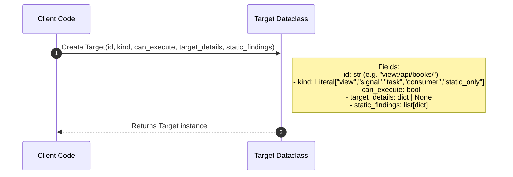

#### 5.1.2 `dqs.core.analyzer.AST Analyzer`

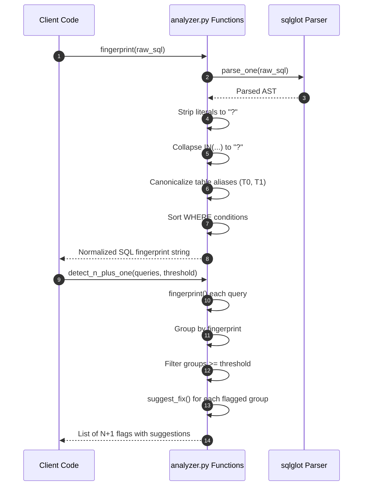

#### 5.1.3 `dqs.core.static_advisor.StaticASTAdvisor`

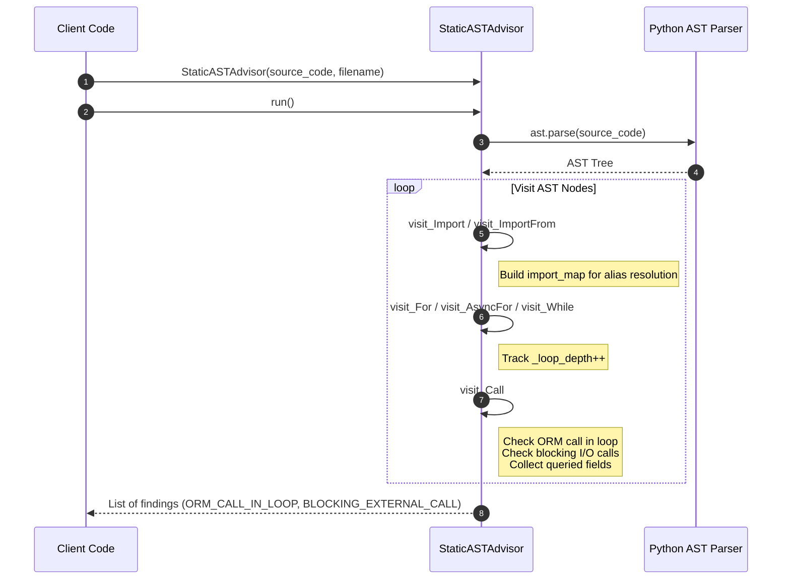

---

### 5.2 Django Adapter Classes

#### 5.2.1 `dqs.adapters.drf.routing.introspector.DjangoIntrospector`

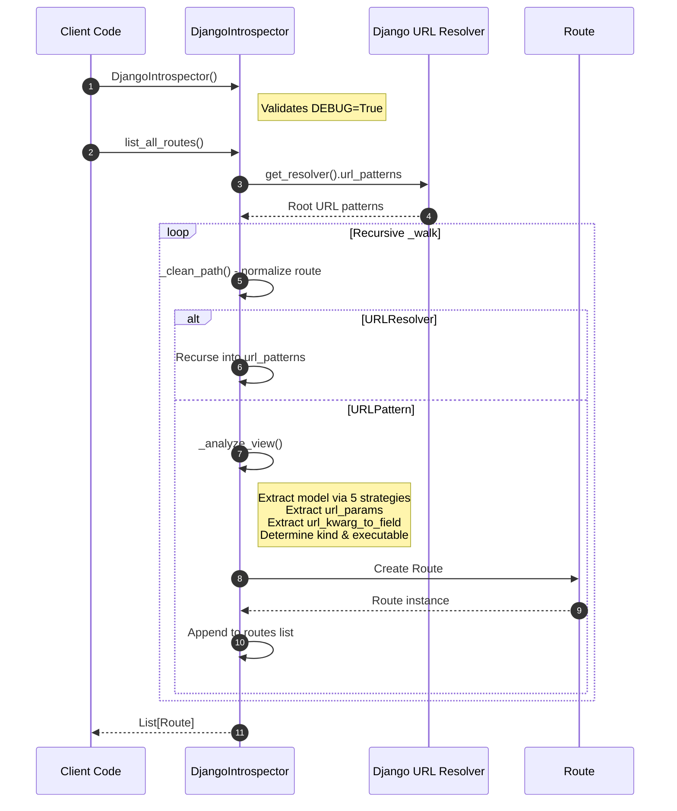

#### 5.2.2 `dqs.adapters.drf.routing.converters.PathConverterResolver`

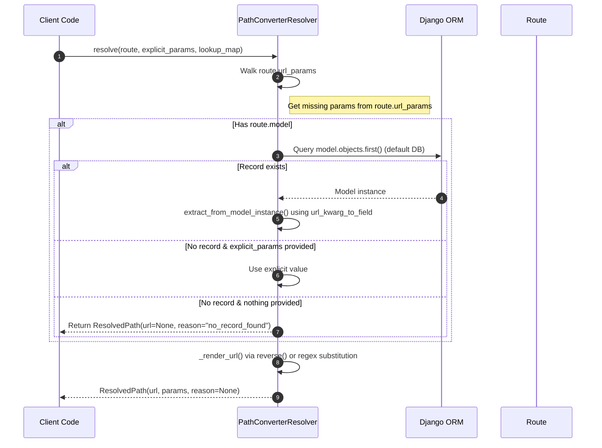

#### 5.2.3 `dqs.adapters.drf.payload_suggester.PayloadSuggester` — _deferred_

The `payload_suggester` module is **deferred to a later release**. Payloads are currently caller-supplied via the `body` field of `POST /profiler/execute`. When added, it will follow this shape:

#### 5.2.4 `dqs.adapters.drf.execution.query_interceptor.QueryInterceptor`

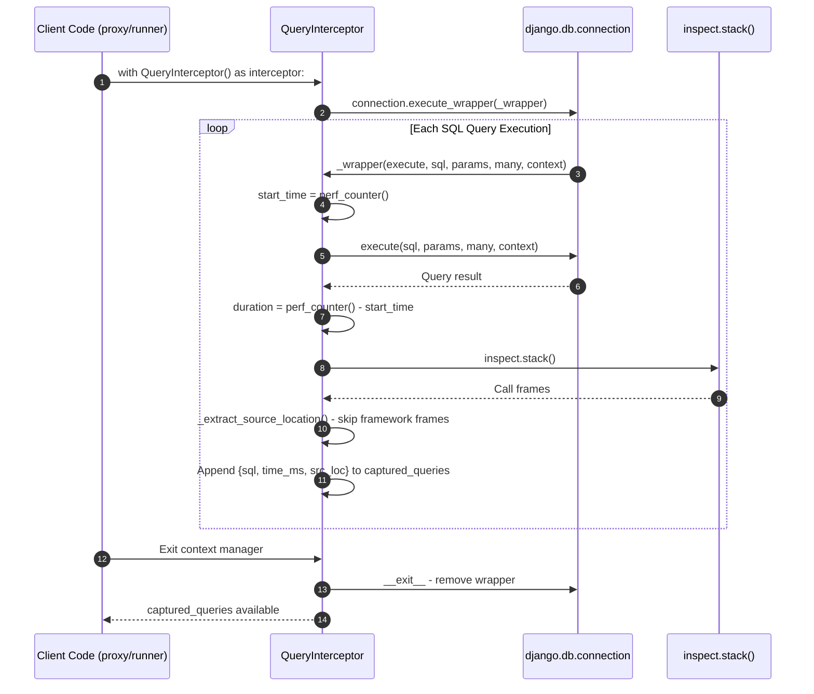

#### 5.2.5 `dqs.adapters.drf.execution.query_interceptor.QueryAnalysisEngine`

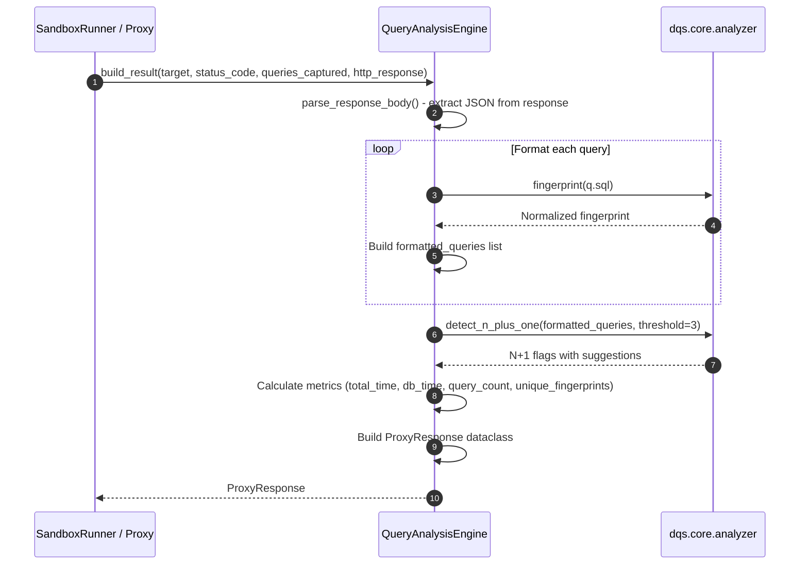

#### 5.2.6 `dqs.adapters.drf.execution.runner.DjangoSandboxRunner`

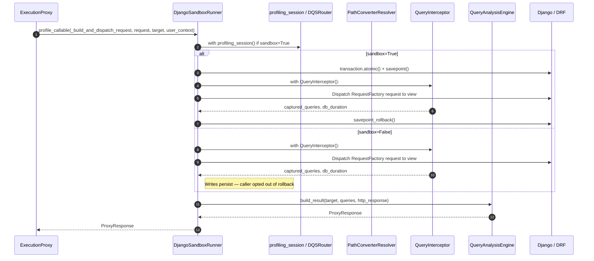

#### 5.2.7 `dqs.adapters.drf.execution.proxy.ExecutionProxy` _(new in v0.5)_

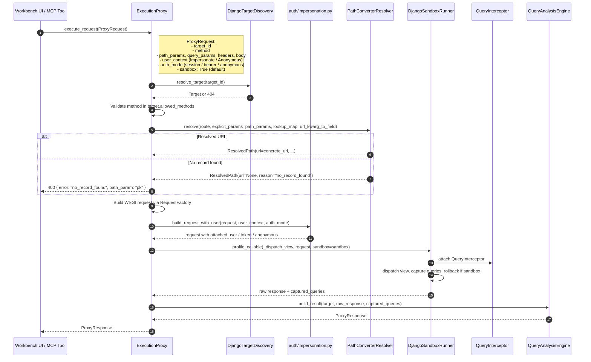

#### 5.2.8 `dqs.adapters.drf.execution.discovery.DjangoTargetDiscovery`

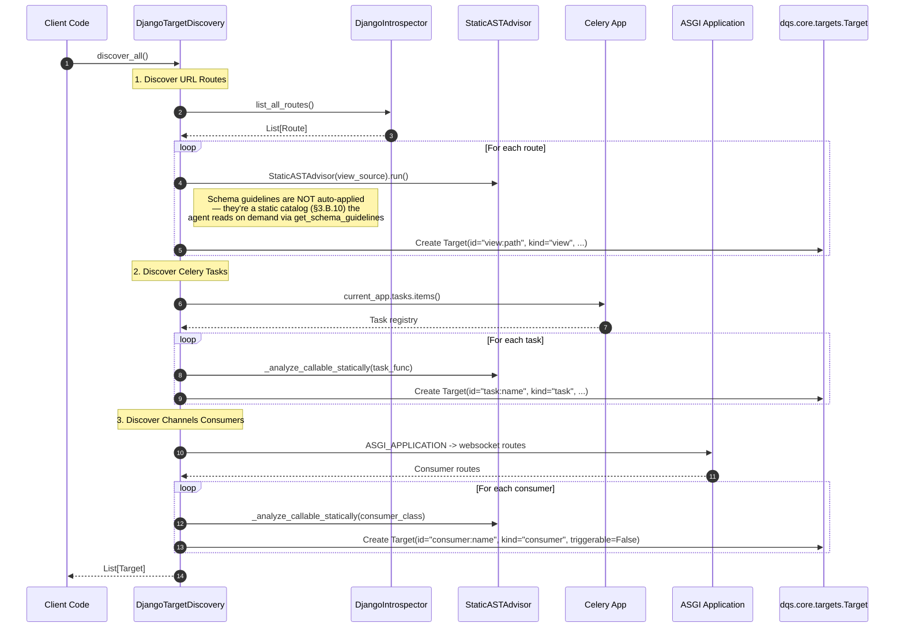

#### 5.2.9 `dqs.adapters.drf.router.DQSRouter` & `profiling_session`

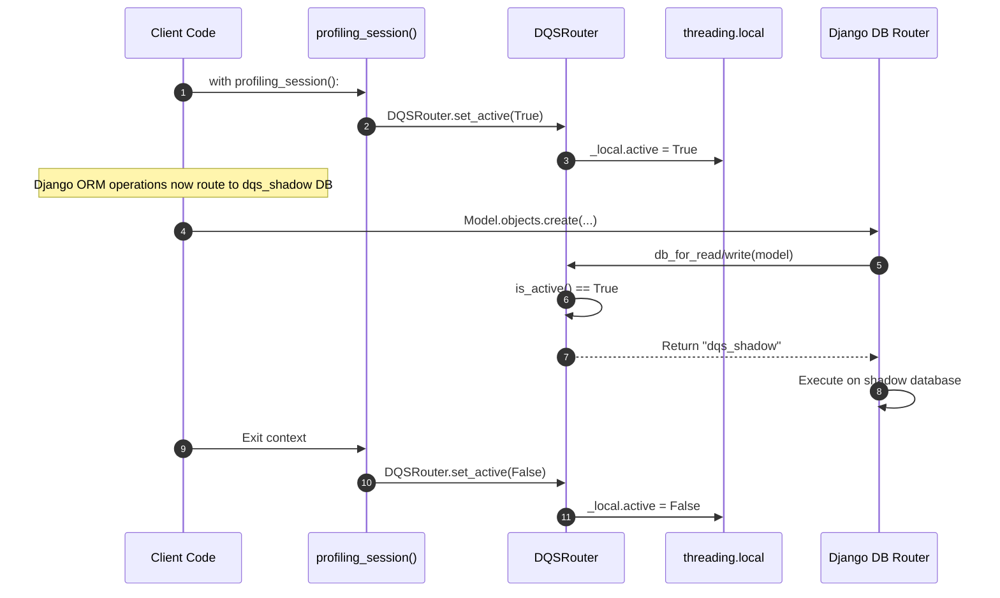

---

## 6. End-to-End Execution Sequence

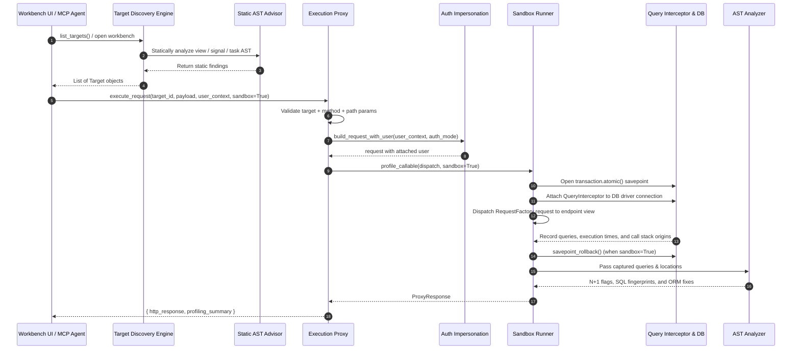

---

## 7. Security & Isolation Model

- **Toggleable Sandbox (default ON)**: Every request runs inside an atomic savepoint and is rolled back automatically. The caller can opt out per-call (`sandbox: False`) when it actually wants a write to persist.
- **`DEBUG=True` Guardrail**: Profiling runs only in development environments — enforced in `apps.py` and `DjangoIntrospector`.
- **Sanitized SQL**: AST fingerprinting strips user data/literals before rendering analysis reports.
- **Shadow Database** _(legacy / opt-out path)_: Optional isolated database (`dqs_shadow`) for cases when sandbox is off and the caller wants writes routed away from `default`. Configured via `DATABASE_ROUTERS` and `profiling_session()`.
- **No Network Roundtrip for Auth**: `force_authenticate` short-circuits the auth backend so user impersonation is instant. Tokens are generated in-process when `auth_mode="bearer"`.
- **No Auto-Seeding**: The proxy never writes to the DB on the caller's behalf. If a path param can't be resolved against real data, the request fails loudly with a clear reason — the UI surfaces this as "Pick a record or enter a value," the MCP agent gets a structured 400.

---

## 8. Installation & Testing

### Development Installation

```bash
# From source (editable install)
pip install -e "C:\Users\mprof\OneDrive\Desktop\da-profiler"

# Or build and install
pip install dist/da_profiler-0.3.0-py3-none-any.whl
```

### Demo Project Setup

```bash
# 1. Go to demo project
cd demos/drf

# 2. Install dependencies
pip install -e "..[django]"

# 3. Configure settings (DEBUG=True, dqs_shadow DB, DATABASE_ROUTERS)

# 4. Run migrations on shadow DB
python manage.py migrate --database=dqs_shadow

# 5. Run tests
pytest -m core        # Pure Python tests (fast, no DB)
pytest -m django      # Django/DRF adapter tests (requires DB)
pytest                # All tests
```

### Using in Your Own Project

```bash
# Install from PyPI
pip install da-profiler[django]

# Add to settings.py (development only)
if DEBUG:
    INSTALLED_APPS += ["dqs.adapters.drf"]
    DATABASE_ROUTERS = ["dqs.adapters.drf.router.DQSRouter"]

# Configure shadow database
DATABASES = {
    "default": {...},
    "dqs_shadow": {...},  # Same engine as default
}

# Run shadow migrations
python manage.py migrate --database=dqs_shadow
```

---

## 9. Key Data Flow Summary

| Stage                     | Input                                                      | Component                              | Output                                                                     |
| ------------------------- | ---------------------------------------------------------- | -------------------------------------- | -------------------------------------------------------------------------- |
| **Discovery**             | Django URL patterns + signal/task registries               | `DjangoTargetDiscovery`                | `List[Target]` (consumed by workbench sidebar AND `list_targets` MCP tool) |
| **Static analysis**       | Target source code                                         | `StaticASTAdvisor`                     | `static_findings` (N+1 candidates, blocking I/O)                           |
| **Payload suggestion**    | `target_id`, optional `field_overrides`                    | `PayloadSuggester`                     | `{ template, notes, warnings }` — never writes to DB                       |
| **Path-param resolution** | Route + explicit params                                    | `PathConverterResolver`                | Concrete URL, or `None + reason` if no record found                        |
| **Execution proxy**       | `ProxyRequest` (target_id, payload, user_context, sandbox) | `ExecutionProxy`                       | `ProxyResponse` (http_response + profiling_summary)                        |
| **Auth injection**        | request + user_context + auth_mode                         | `auth/impersonation.py`                | request with `force_authenticate` / token / anonymous                      |
| **Sandbox execution**     | View callable + WSGI request                               | `DjangoSandboxRunner.profile_callable` | HTTP response + captured queries                                           |
| **Interception**          | DB queries                                                 | `QueryInterceptor`                     | Queries with origin (file:line) + duration                                 |
| **Schema guidelines**     | (none — catalog is static data)                            | `execution/schema_advisor.py`          | `List[SchemaGuideline]` — surfaced via MCP `get_schema_guidelines()` tool |
| **Analysis**              | Captured queries                                           | `QueryAnalysisEngine` + `analyzer.py`  | N+1 flags + ORM fixes                                                      |
| **Agent loop**            | N+1 flag + suggested fix                                   | MCP `apply_fix` tool                   | AST-edited source; re-profile to verify                                    |

---
